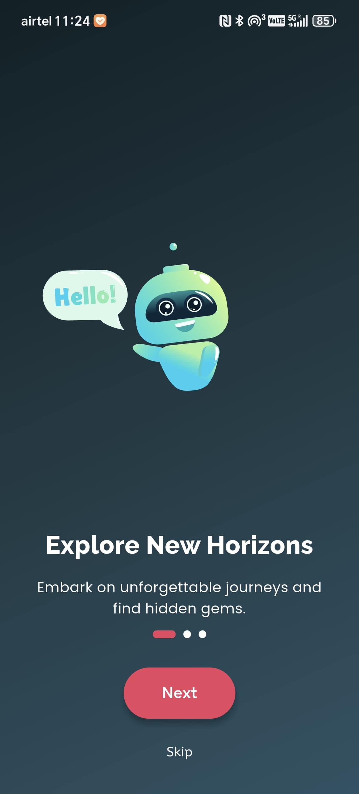
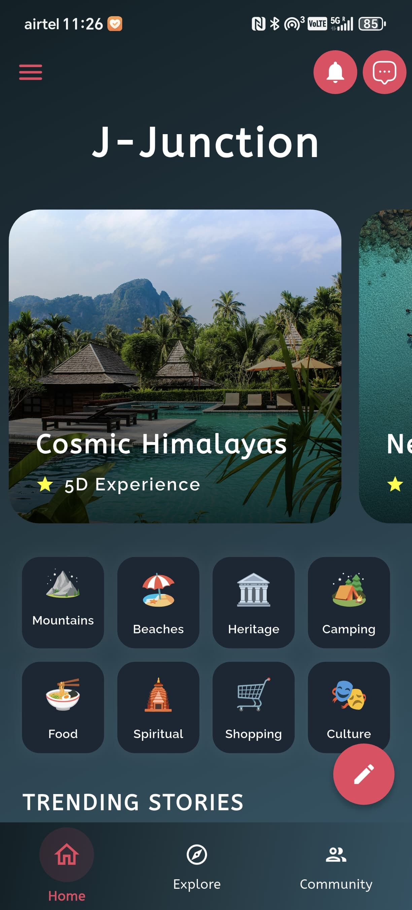

# ✈️ new_flutter_app

A modern Flutter application designed to bring travelers together through community, discussions, and shared experiences.

---

## 📸 Screenshots

  
  
  
  
  
  
  
  
  
  
  
  
  
  
  
  
  
  
  
  
  
  
  
  
  
  
  
  
  
  
  
  
  
  
  
  
  
  
  
  

---

## 🚀 Features

- 👥 **Community Page**: Join a community, view total members, online users, and trending topics.
- 💬 **Discussions**: Start or join discussions with other travelers.
- 📝 **Community Posts**: Share posts with categories & tags.
- 👨‍👩‍👧‍👦 **Groups**: Create and manage groups with invitations, accept/reject options, and s.
- 🔔 **Invitations**: Get notified about group invites and respond instantly.

---

## 🛠️ Getting Started

### Prerequisites

- Flutter SDK (>=3.0.0)
- Dart (>=2.17)
- Firebase project configured with Firestore & Authentication
